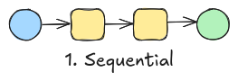
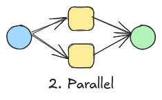
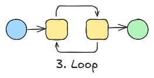
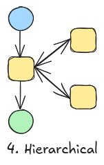
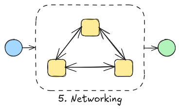

# Agentic System

## Types of agentic system

### Categorize by step
- single-step
- multi-step

### Categorize by participant
- single-agent
- multi-agent

### Categorize by team size
- Fixed-size team
- Flexible-size team

### Categorize by interaction
- autonomous
- interactive

### Categorize by application
- compute-intensive applications
- retrieval-intensive applications
- generation-intensive applications

### Categorize by complexity
- Simple tasks
- Complex tasks

### Categorize by task type
- Perception-based
- Cognition-based
- Action-based

## Multi-agent architecture patterns

**Sequential**

    
     
    <em>Figure 1: Sequential Diagram.</em>

**Parallel**

    
     
    <em>Figure 2: Parallel Diagram.</em>

**Loop**

    
     
    <em>Figure 3: Loop Diagram.</em>

**Hierarchical**

    
     
    <em>Figure 4: Hierarchical Diagram.</em>

**Networking (Team)**

    
     
    <em>Figure 5: Networking Diagram.</em>

- Selector + Workers
- Orchestrator + Workers
- Round Robin
- Swarm
- **Competition**

## What’s Happening Around the World?

- Some researchers focus on **benchmarking** (e.g., GAIA, SWBench).
- Others try to **modify agent's behavior** (e.g., ReAct, CodeAct).
- Some try to **improve agent's ability** (improve memory, reasoning, safety, well-aligned, etc.)
- Some study **agent's collaboration** (e.g., MagenticOne, Alita).
- Others work on **delivering agent-related frameworks, platforms, and applications**.

## Compare Agent with LLM

| Aspect | LLM with Tools | Agentic System |
|--------|---------------|----------------|
| **Architecture** | Single model + function calling | Multi-component system with planning, memory, and execution modules |
| **Decision Making** | Reactive - responds to immediate input | Proactive - can initiate actions and plan ahead |
| **Memory** | Limited to context window | Persistent memory across sessions and tasks |
| **Planning** | Basic step-by-step reasoning | Advanced planning with goal decomposition and strategy adaptation |
| **Tool Usage** | Direct function calls based on current context | Strategic tool selection with multi-step workflows |
| **Error Handling** | Limited retry mechanisms | Sophisticated error recovery and plan adjustment |
| **Learning** | Static - no learning from interactions | Can learn from experience and improve over time |
| **Autonomy** | Requires explicit instructions for each step | Can operate independently with high-level goals |
| **Collaboration** | Single entity interaction | Multi-agent coordination and communication |
| **State Management** | Stateless between conversations | Maintains state and context across interactions |
| **Task Complexity** | Good for single-turn, well-defined tasks | Excels at complex, multi-step, long-term objectives |
| **Adaptability** | Limited to pre-defined tools and patterns | Can adapt strategies and discover new approaches |
| **Feedback Loop** | One-way: input → processing → output | Continuous feedback and refinement cycles |
| **Resource Management** | No resource planning or optimization | Can manage computational and time resources |
| **Goal Alignment** | Follows immediate instructions | Maintains alignment with long-term objectives |

### Key Differences Summary

**LLM with Tools:**
- **Strengths**: Fast, predictable, good for well-defined tasks, easy to control
- **Limitations**: No persistence, limited planning, reactive only, no learning

**Agentic Systems:**
- **Strengths**: Autonomous operation, complex problem solving, adaptive learning, persistent memory
- **Limitations**: More complex to build and control, potential for unexpected behavior, higher computational overhead

## Example Queries

### Really Hard Queries
- What are the latest developments in AI safety research?
- If LLM trainings continue to scale up at the current rhythm until 2030, what would be the electric power in GW required to power the biggest training runs by 2030? What does that correspond to, compared to some countries? Please provide a source for any number used.

### Agentic System
- "Book a flight from SFO to JFK next Friday under $300 and add the itinerary to my Google Calendar."
- "Fetch the latest World Bank GDP for Japan, plot the last 5 years, and summarize the trend in 3 bullet points."
- "Compare MacBook Air M2 vs. ThinkPad X1 Carbon (2024) specs, price, and reviews; recommend one with purchase links."

### Software Development
- "In the repository, fix the bug causing `parse_args` to throw TypeError when no flags are provided; add a unit test and open a PR."
- "Resolve Issue #342: memory leak in `ImageCache` during batch processing; write regression tests to cover the fix."
- "Update to `requests>=2.32` and refactor deprecated calls; ensure CI passes on Python 3.11."

### Personal Assistant
- "Schedule a dentist appointment next week between 3–5pm near 10001; confirm by email."
- "Find a 4.5+ star vegan restaurant within 2 miles and book a table for 4 at 7pm Friday."
- "Renew my car registration on the DMV site; walk me through any forms and fees."

### Data Analysis
- "In a spreadsheet, compute monthly spend per category, flag anomalies >2σ, and export a summary CSV."
- "Navigate the retailer’s website to locate the return policy for electronics and start a return for Order #12345."
- "Use the weather API to fetch this week’s forecast and generate a 7-day activity plan with packing checklist."

### Planning and Reasoning
- "If the living-room motion sensor is idle for 5 minutes after sunset, turn off the lights unless ‘Movie Mode’ is active."
- "Plan the sequence to move blocks A, B, C so that A ends on C with minimal moves given stacking constraints."
- "Set a rule: if a stock falls 5% intraday and earnings are not tomorrow, place a stop-loss; otherwise, alert only."

### Research
- "Reproduce Figure 3 from the LoRA paper using the provided seed and report BLEU and training time."
- "Recreate the ablation table on CIFAR-10 comparing optimizers (SGD, AdamW, Lion) with identical budgets."
- "Implement the method section from ‘Paper X’, run on the author’s dataset, and verify metrics within ±1%."

### E-commerce
- "Find a red cotton T‑shirt under $25 in size M, add to cart, and share the cart link."
- "Log into the forum, search for ‘install docker on ubuntu’, upvote the best answer, and bookmark the thread."
- "Navigate a documentation site to download the latest API SDK for Python and verify the checksum."